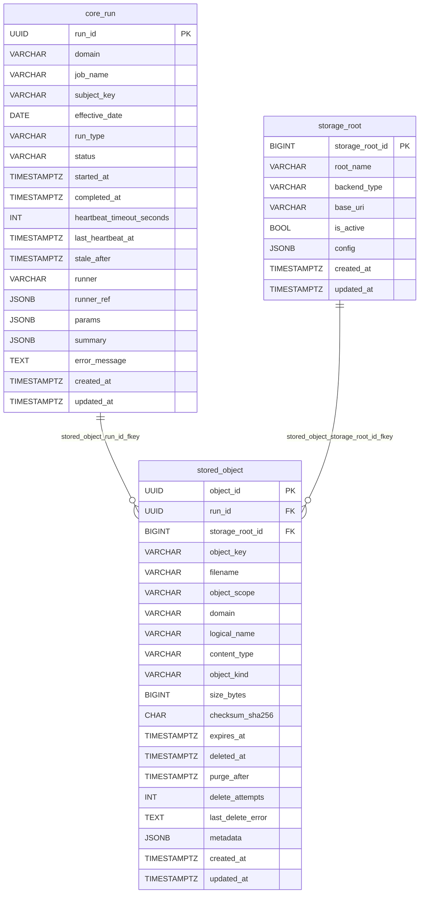

```mermaid
erDiagram
  core_run {
    UUID run_id PK
    VARCHAR domain
    VARCHAR job_name
    VARCHAR subject_key
    DATE effective_date
    VARCHAR run_type
    VARCHAR status
    TIMESTAMPTZ started_at
    TIMESTAMPTZ completed_at
    INT heartbeat_timeout_seconds
    TIMESTAMPTZ last_heartbeat_at
    TIMESTAMPTZ stale_after
    VARCHAR runner
    JSONB runner_ref
    JSONB params
    JSONB summary
    TEXT error_message
    TIMESTAMPTZ created_at
    TIMESTAMPTZ updated_at
  }

  storage_root {
    BIGINT storage_root_id PK
    VARCHAR root_name
    VARCHAR backend_type
    VARCHAR base_uri
    BOOL is_active
    JSONB config
    TIMESTAMPTZ created_at
    TIMESTAMPTZ updated_at
  }

  stored_object {
    UUID object_id PK
    UUID run_id FK
    BIGINT storage_root_id FK
    VARCHAR object_key
    VARCHAR filename
    VARCHAR object_scope
    VARCHAR domain
    VARCHAR logical_name
    VARCHAR content_type
    VARCHAR object_kind
    BIGINT size_bytes
    CHAR checksum_sha256
    TIMESTAMPTZ expires_at
    TIMESTAMPTZ deleted_at
    TIMESTAMPTZ purge_after
    INT delete_attempts
    TEXT last_delete_error
    JSONB metadata
    TIMESTAMPTZ created_at
    TIMESTAMPTZ updated_at
  }

  core_run ||--o{ stored_object : "stored_object_run_id_fkey"
  storage_root ||--o{ stored_object : "stored_object_storage_root_id_fkey"
```
