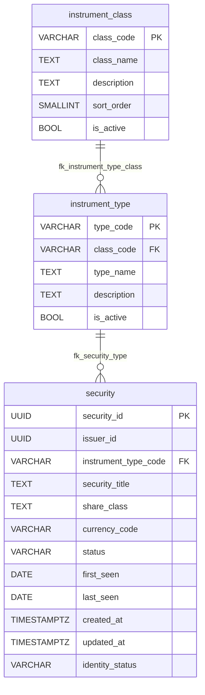

```mermaid
erDiagram
  instrument_class {
    VARCHAR class_code PK
    TEXT class_name
    TEXT description
    SMALLINT sort_order
    BOOL is_active
  }

  instrument_type {
    VARCHAR type_code PK
    VARCHAR class_code FK
    TEXT type_name
    TEXT description
    BOOL is_active
  }

  security {
    UUID security_id PK
    UUID issuer_id
    VARCHAR instrument_type_code FK
    TEXT security_title
    TEXT share_class
    VARCHAR currency_code
    VARCHAR status
    DATE first_seen
    DATE last_seen
    TIMESTAMPTZ created_at
    TIMESTAMPTZ updated_at
    VARCHAR identity_status
  }

  instrument_class ||--o{ instrument_type : "fk_instrument_type_class"
  instrument_type ||--o{ security : "fk_security_type"
```
