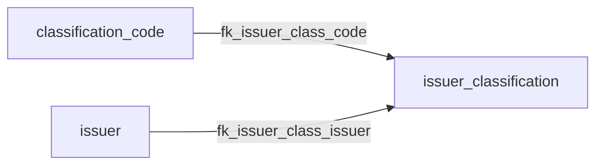

```mermaid
flowchart LR
  classification_code["classification_code"]
  issuer["issuer"]
  issuer_classification["issuer_classification"]

  classification_code -->|fk_issuer_class_code| issuer_classification
  issuer -->|fk_issuer_class_issuer| issuer_classification
```
