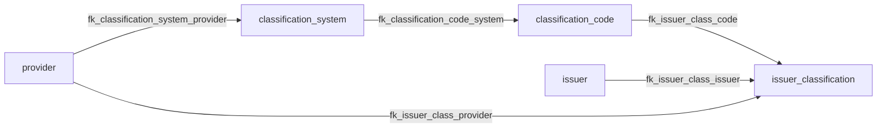

```mermaid
flowchart LR
  classification_code["classification_code"]
  classification_system["classification_system"]
  issuer["issuer"]
  issuer_classification["issuer_classification"]
  provider["provider"]

  classification_system -->|fk_classification_code_system| classification_code
  provider -->|fk_classification_system_provider| classification_system
  classification_code -->|fk_issuer_class_code| issuer_classification
  issuer -->|fk_issuer_class_issuer| issuer_classification
  provider -->|fk_issuer_class_provider| issuer_classification
```
