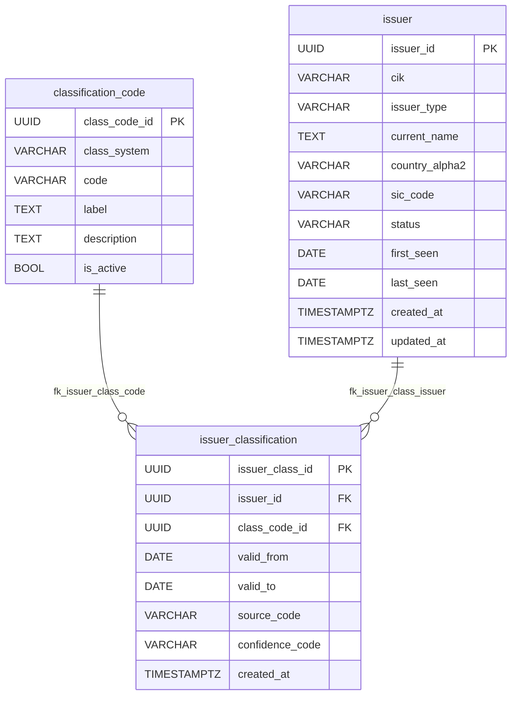

```mermaid
erDiagram
  classification_code {
    UUID class_code_id PK
    VARCHAR class_system
    VARCHAR code
    TEXT label
    TEXT description
    BOOL is_active
  }

  issuer {
    UUID issuer_id PK
    VARCHAR cik
    VARCHAR issuer_type
    TEXT current_name
    VARCHAR country_alpha2
    VARCHAR sic_code
    VARCHAR status
    DATE first_seen
    DATE last_seen
    TIMESTAMPTZ created_at
    TIMESTAMPTZ updated_at
  }

  issuer_classification {
    UUID issuer_class_id PK
    UUID issuer_id FK
    UUID class_code_id FK
    DATE valid_from
    DATE valid_to
    VARCHAR source_code
    VARCHAR confidence_code
    TIMESTAMPTZ created_at
  }

  classification_code ||--o{ issuer_classification : "fk_issuer_class_code"
  issuer ||--o{ issuer_classification : "fk_issuer_class_issuer"
```
