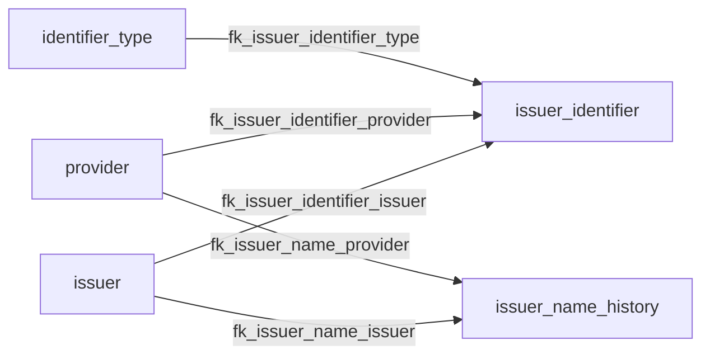

```mermaid
flowchart LR
  identifier_type["identifier_type"]
  issuer["issuer"]
  issuer_identifier["issuer_identifier"]
  issuer_name_history["issuer_name_history"]
  provider["provider"]

  issuer -->|fk_issuer_identifier_issuer| issuer_identifier
  provider -->|fk_issuer_identifier_provider| issuer_identifier
  identifier_type -->|fk_issuer_identifier_type| issuer_identifier
  issuer -->|fk_issuer_name_issuer| issuer_name_history
  provider -->|fk_issuer_name_provider| issuer_name_history
```
