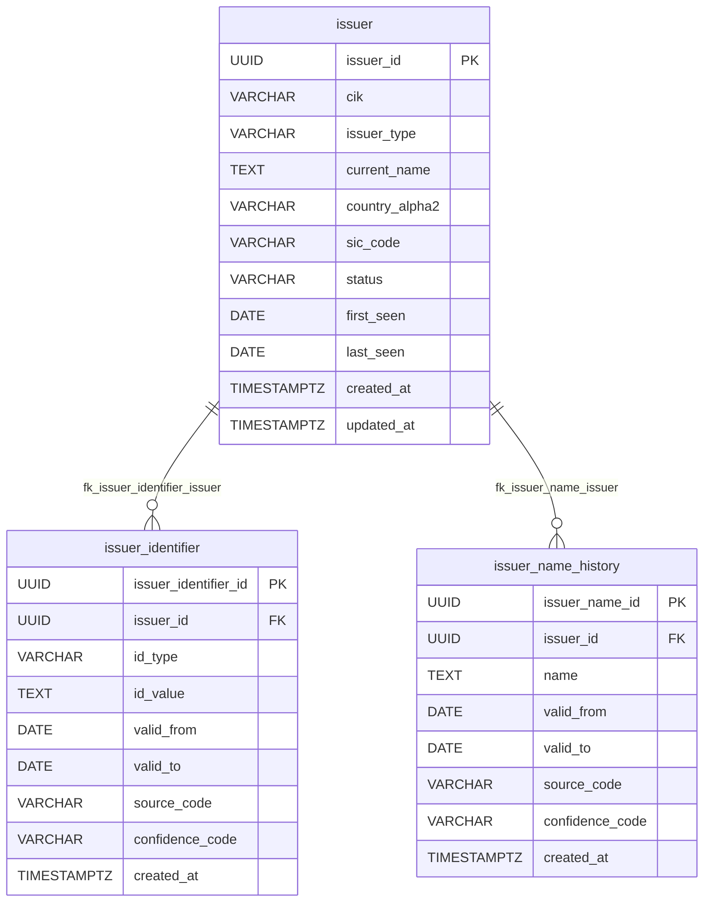

```mermaid
erDiagram
  issuer {
    UUID issuer_id PK
    VARCHAR cik
    VARCHAR issuer_type
    TEXT current_name
    VARCHAR country_alpha2
    VARCHAR sic_code
    VARCHAR status
    DATE first_seen
    DATE last_seen
    TIMESTAMPTZ created_at
    TIMESTAMPTZ updated_at
  }

  issuer_identifier {
    UUID issuer_identifier_id PK
    UUID issuer_id FK
    VARCHAR id_type
    TEXT id_value
    DATE valid_from
    DATE valid_to
    VARCHAR source_code
    VARCHAR confidence_code
    TIMESTAMPTZ created_at
  }

  issuer_name_history {
    UUID issuer_name_id PK
    UUID issuer_id FK
    TEXT name
    DATE valid_from
    DATE valid_to
    VARCHAR source_code
    VARCHAR confidence_code
    TIMESTAMPTZ created_at
  }

  issuer ||--o{ issuer_identifier : "fk_issuer_identifier_issuer"
  issuer ||--o{ issuer_name_history : "fk_issuer_name_issuer"
```
