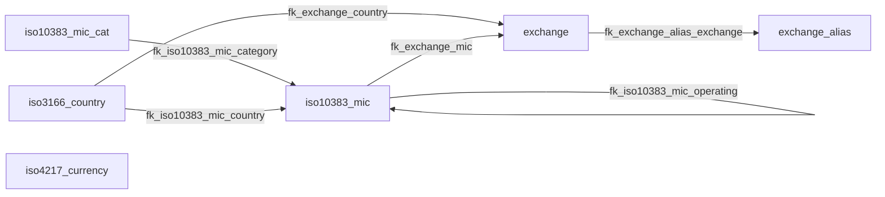

```mermaid
flowchart LR
  exchange["exchange"]
  exchange_alias["exchange_alias"]
  iso10383_mic["iso10383_mic"]
  iso10383_mic_cat["iso10383_mic_cat"]
  iso3166_country["iso3166_country"]
  iso4217_currency["iso4217_currency"]

  iso3166_country -->|fk_exchange_country| exchange
  iso10383_mic -->|fk_exchange_mic| exchange
  exchange -->|fk_exchange_alias_exchange| exchange_alias
  iso10383_mic_cat -->|fk_iso10383_mic_category| iso10383_mic
  iso3166_country -->|fk_iso10383_mic_country| iso10383_mic
  iso10383_mic -->|fk_iso10383_mic_operating| iso10383_mic
```
