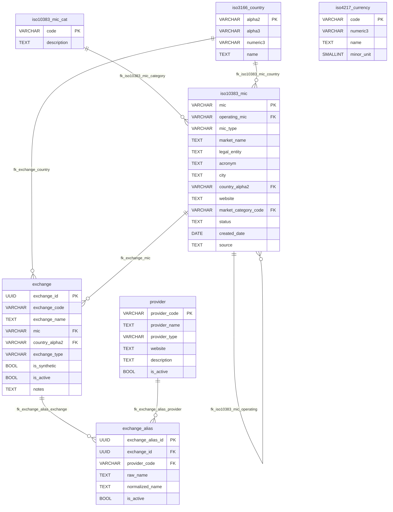

```mermaid
erDiagram
  exchange {
    UUID exchange_id PK
    VARCHAR exchange_code
    TEXT exchange_name
    VARCHAR mic FK
    VARCHAR country_alpha2 FK
    VARCHAR exchange_type
    BOOL is_synthetic
    BOOL is_active
    TEXT notes
  }

  exchange_alias {
    UUID exchange_alias_id PK
    UUID exchange_id FK
    VARCHAR provider_code FK
    TEXT raw_name
    TEXT normalized_name
    BOOL is_active
  }

  iso10383_mic {
    VARCHAR mic PK
    VARCHAR operating_mic FK
    VARCHAR mic_type
    TEXT market_name
    TEXT legal_entity
    TEXT acronym
    TEXT city
    VARCHAR country_alpha2 FK
    TEXT website
    VARCHAR market_category_code FK
    TEXT status
    DATE created_date
    TEXT source
  }

  iso10383_mic_cat {
    VARCHAR code PK
    TEXT description
  }

  iso3166_country {
    VARCHAR alpha2 PK
    VARCHAR alpha3
    VARCHAR numeric3
    TEXT name
  }

  iso4217_currency {
    VARCHAR code PK
    VARCHAR numeric3
    TEXT name
    SMALLINT minor_unit
  }

  provider {
    VARCHAR provider_code PK
    TEXT provider_name
    VARCHAR provider_type
    TEXT website
    TEXT description
    BOOL is_active
  }

  iso3166_country ||--o{ exchange : "fk_exchange_country"
  iso10383_mic ||--o{ exchange : "fk_exchange_mic"
  exchange ||--o{ exchange_alias : "fk_exchange_alias_exchange"
  provider ||--o{ exchange_alias : "fk_exchange_alias_provider"
  iso10383_mic_cat ||--o{ iso10383_mic : "fk_iso10383_mic_category"
  iso3166_country ||--o{ iso10383_mic : "fk_iso10383_mic_country"
  iso10383_mic ||--o{ iso10383_mic : "fk_iso10383_mic_operating"
```
