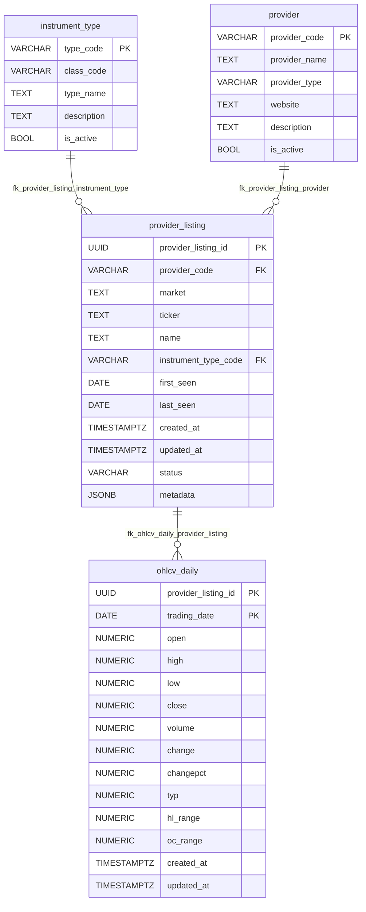

```mermaid
erDiagram
  instrument_type {
    VARCHAR type_code PK
    VARCHAR class_code
    TEXT type_name
    TEXT description
    BOOL is_active
  }

  ohlcv_daily {
    UUID provider_listing_id PK
    DATE trading_date PK
    NUMERIC open
    NUMERIC high
    NUMERIC low
    NUMERIC close
    NUMERIC volume
    NUMERIC change
    NUMERIC changepct
    NUMERIC typ
    NUMERIC hl_range
    NUMERIC oc_range
    TIMESTAMPTZ created_at
    TIMESTAMPTZ updated_at
  }

  provider {
    VARCHAR provider_code PK
    TEXT provider_name
    VARCHAR provider_type
    TEXT website
    TEXT description
    BOOL is_active
  }

  provider_listing {
    UUID provider_listing_id PK
    VARCHAR provider_code FK
    TEXT market
    TEXT ticker
    TEXT name
    VARCHAR instrument_type_code FK
    DATE first_seen
    DATE last_seen
    TIMESTAMPTZ created_at
    TIMESTAMPTZ updated_at
    VARCHAR status
    JSONB metadata
  }

  provider_listing ||--o{ ohlcv_daily : "fk_ohlcv_daily_provider_listing"
  instrument_type ||--o{ provider_listing : "fk_provider_listing_instrument_type"
  provider ||--o{ provider_listing : "fk_provider_listing_provider"
```
