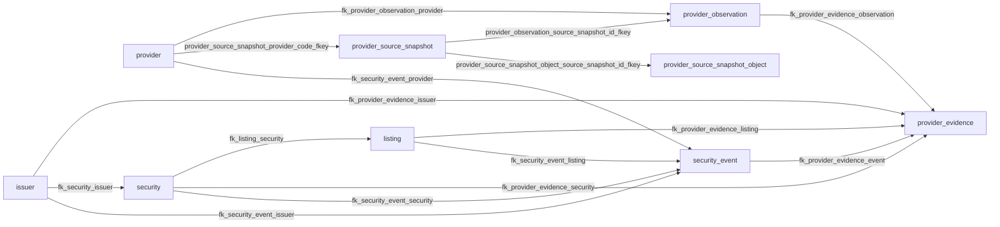

```mermaid
flowchart LR
  issuer["issuer"]
  listing["listing"]
  provider["provider"]
  provider_evidence["provider_evidence"]
  provider_observation["provider_observation"]
  provider_source_snapshot["provider_source_snapshot"]
  provider_source_snapshot_object["provider_source_snapshot_object"]
  security["security"]
  security_event["security_event"]

  security -->|fk_listing_security| listing
  security_event -->|fk_provider_evidence_event| provider_evidence
  issuer -->|fk_provider_evidence_issuer| provider_evidence
  listing -->|fk_provider_evidence_listing| provider_evidence
  provider_observation -->|fk_provider_evidence_observation| provider_evidence
  security -->|fk_provider_evidence_security| provider_evidence
  provider -->|fk_provider_observation_provider| provider_observation
  provider_source_snapshot -->|provider_observation_source_snapshot_id_fkey| provider_observation
  provider -->|provider_source_snapshot_provider_code_fkey| provider_source_snapshot
  provider_source_snapshot -->|provider_source_snapshot_object_source_snapshot_id_fkey| provider_source_snapshot_object
  issuer -->|fk_security_issuer| security
  issuer -->|fk_security_event_issuer| security_event
  listing -->|fk_security_event_listing| security_event
  provider -->|fk_security_event_provider| security_event
  security -->|fk_security_event_security| security_event
```
