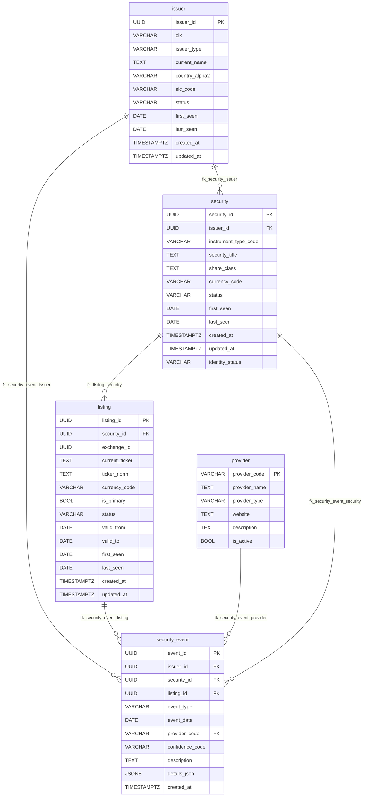

```mermaid
erDiagram
  issuer {
    UUID issuer_id PK
    VARCHAR cik
    VARCHAR issuer_type
    TEXT current_name
    VARCHAR country_alpha2
    VARCHAR sic_code
    VARCHAR status
    DATE first_seen
    DATE last_seen
    TIMESTAMPTZ created_at
    TIMESTAMPTZ updated_at
  }

  listing {
    UUID listing_id PK
    UUID security_id FK
    UUID exchange_id
    TEXT current_ticker
    TEXT ticker_norm
    VARCHAR currency_code
    BOOL is_primary
    VARCHAR status
    DATE valid_from
    DATE valid_to
    DATE first_seen
    DATE last_seen
    TIMESTAMPTZ created_at
    TIMESTAMPTZ updated_at
  }

  provider {
    VARCHAR provider_code PK
    TEXT provider_name
    VARCHAR provider_type
    TEXT website
    TEXT description
    BOOL is_active
  }

  security {
    UUID security_id PK
    UUID issuer_id FK
    VARCHAR instrument_type_code
    TEXT security_title
    TEXT share_class
    VARCHAR currency_code
    VARCHAR status
    DATE first_seen
    DATE last_seen
    TIMESTAMPTZ created_at
    TIMESTAMPTZ updated_at
    VARCHAR identity_status
  }

  security_event {
    UUID event_id PK
    UUID issuer_id FK
    UUID security_id FK
    UUID listing_id FK
    VARCHAR event_type
    DATE event_date
    VARCHAR provider_code FK
    VARCHAR confidence_code
    TEXT description
    JSONB details_json
    TIMESTAMPTZ created_at
  }

  security ||--o{ listing : "fk_listing_security"
  issuer ||--o{ security : "fk_security_issuer"
  issuer ||--o{ security_event : "fk_security_event_issuer"
  listing ||--o{ security_event : "fk_security_event_listing"
  provider ||--o{ security_event : "fk_security_event_provider"
  security ||--o{ security_event : "fk_security_event_security"
```
