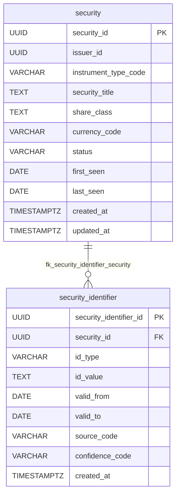

```mermaid
erDiagram
  security {
    UUID security_id PK
    UUID issuer_id
    VARCHAR instrument_type_code
    TEXT security_title
    TEXT share_class
    VARCHAR currency_code
    VARCHAR status
    DATE first_seen
    DATE last_seen
    TIMESTAMPTZ created_at
    TIMESTAMPTZ updated_at
  }

  security_identifier {
    UUID security_identifier_id PK
    UUID security_id FK
    VARCHAR id_type
    TEXT id_value
    DATE valid_from
    DATE valid_to
    VARCHAR source_code
    VARCHAR confidence_code
    TIMESTAMPTZ created_at
  }

  security ||--o{ security_identifier : "fk_security_identifier_security"
```
