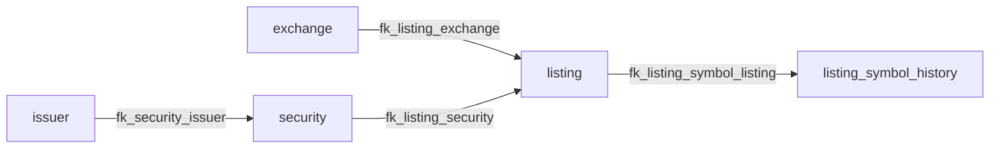

```mermaid
flowchart LR
  exchange["exchange"]
  issuer["issuer"]
  listing["listing"]
  listing_symbol_history["listing_symbol_history"]
  security["security"]

  exchange -->|fk_listing_exchange| listing
  security -->|fk_listing_security| listing
  listing -->|fk_listing_symbol_listing| listing_symbol_history
  issuer -->|fk_security_issuer| security
```
