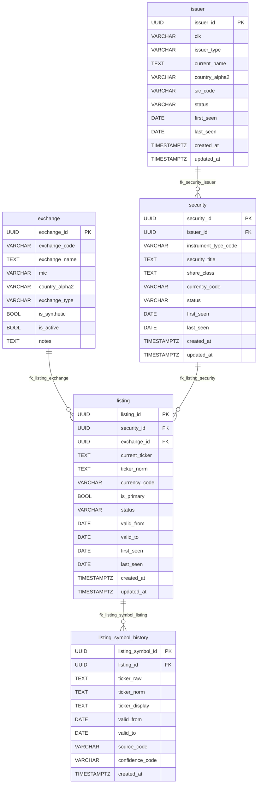

```mermaid
erDiagram
  exchange {
    UUID exchange_id PK
    VARCHAR exchange_code
    TEXT exchange_name
    VARCHAR mic
    VARCHAR country_alpha2
    VARCHAR exchange_type
    BOOL is_synthetic
    BOOL is_active
    TEXT notes
  }

  issuer {
    UUID issuer_id PK
    VARCHAR cik
    VARCHAR issuer_type
    TEXT current_name
    VARCHAR country_alpha2
    VARCHAR sic_code
    VARCHAR status
    DATE first_seen
    DATE last_seen
    TIMESTAMPTZ created_at
    TIMESTAMPTZ updated_at
  }

  listing {
    UUID listing_id PK
    UUID security_id FK
    UUID exchange_id FK
    TEXT current_ticker
    TEXT ticker_norm
    VARCHAR currency_code
    BOOL is_primary
    VARCHAR status
    DATE valid_from
    DATE valid_to
    DATE first_seen
    DATE last_seen
    TIMESTAMPTZ created_at
    TIMESTAMPTZ updated_at
  }

  listing_symbol_history {
    UUID listing_symbol_id PK
    UUID listing_id FK
    TEXT ticker_raw
    TEXT ticker_norm
    TEXT ticker_display
    DATE valid_from
    DATE valid_to
    VARCHAR source_code
    VARCHAR confidence_code
    TIMESTAMPTZ created_at
  }

  security {
    UUID security_id PK
    UUID issuer_id FK
    VARCHAR instrument_type_code
    TEXT security_title
    TEXT share_class
    VARCHAR currency_code
    VARCHAR status
    DATE first_seen
    DATE last_seen
    TIMESTAMPTZ created_at
    TIMESTAMPTZ updated_at
  }

  exchange ||--o{ listing : "fk_listing_exchange"
  security ||--o{ listing : "fk_listing_security"
  listing ||--o{ listing_symbol_history : "fk_listing_symbol_listing"
  issuer ||--o{ security : "fk_security_issuer"
```
