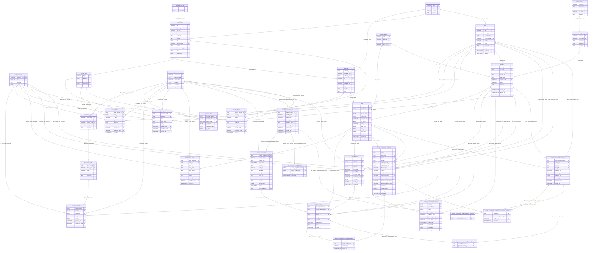

```mermaid
erDiagram
  classification_code {
    UUID class_code_id PK
    VARCHAR class_system FK
    VARCHAR code
    TEXT label
    TEXT description
    BOOL is_active
  }

  classification_system {
    VARCHAR class_system PK
    TEXT system_name
    VARCHAR provider_code FK
    TEXT description
    BOOL is_active
  }

  confidence_level {
    VARCHAR confidence_code PK
    SMALLINT rank
    TEXT description
    BOOL is_active
  }

  exchange {
    UUID exchange_id PK
    VARCHAR exchange_code
    TEXT exchange_name
    VARCHAR mic FK
    VARCHAR country_alpha2 FK
    VARCHAR exchange_type
    BOOL is_synthetic
    BOOL is_active
    TEXT notes
  }

  exchange_alias {
    UUID exchange_alias_id PK
    UUID exchange_id FK
    VARCHAR provider_code FK
    TEXT raw_name
    TEXT normalized_name
    BOOL is_active
  }

  identifier_type {
    VARCHAR id_type PK
    TEXT id_name
    VARCHAR applies_to
    TEXT description
    BOOL is_active
  }

  instrument_class {
    VARCHAR class_code PK
    TEXT class_name
    TEXT description
    SMALLINT sort_order
    BOOL is_active
  }

  instrument_type {
    VARCHAR type_code PK
    VARCHAR class_code FK
    TEXT type_name
    TEXT description
    BOOL is_active
  }

  iso10383_mic {
    VARCHAR mic PK
    VARCHAR operating_mic FK
    VARCHAR mic_type
    TEXT market_name
    TEXT legal_entity
    TEXT acronym
    TEXT city
    VARCHAR country_alpha2 FK
    TEXT website
    VARCHAR market_category_code FK
    TEXT status
    DATE created_date
    TEXT source
  }

  iso10383_mic_cat {
    VARCHAR code PK
    TEXT description
  }

  iso3166_country {
    VARCHAR alpha2 PK
    VARCHAR alpha3
    VARCHAR numeric3
    TEXT name
  }

  iso4217_currency {
    VARCHAR code PK
    VARCHAR numeric3
    TEXT name
    SMALLINT minor_unit
  }

  issuer {
    UUID issuer_id PK
    VARCHAR cik
    VARCHAR issuer_type
    TEXT current_name
    VARCHAR country_alpha2 FK
    VARCHAR sic_code
    VARCHAR status
    DATE first_seen
    DATE last_seen
    TIMESTAMPTZ created_at
    TIMESTAMPTZ updated_at
  }

  issuer_classification {
    UUID issuer_class_id PK
    UUID issuer_id FK
    UUID class_code_id FK
    DATE valid_from
    DATE valid_to
    VARCHAR provider_code FK
    VARCHAR confidence_code FK
    TIMESTAMPTZ created_at
  }

  issuer_identifier {
    UUID issuer_identifier_id PK
    UUID issuer_id FK
    VARCHAR id_type FK
    TEXT id_value
    DATE valid_from
    DATE valid_to
    VARCHAR provider_code FK
    VARCHAR confidence_code FK
    TIMESTAMPTZ created_at
  }

  issuer_name_history {
    UUID issuer_name_id PK
    UUID issuer_id FK
    TEXT name
    DATE valid_from
    DATE valid_to
    VARCHAR provider_code FK
    VARCHAR confidence_code FK
    TIMESTAMPTZ created_at
  }

  listing {
    UUID listing_id PK
    UUID security_id FK
    UUID exchange_id FK
    TEXT current_ticker
    TEXT ticker_norm
    VARCHAR currency_code FK
    BOOL is_primary
    VARCHAR status
    DATE valid_from
    DATE valid_to
    DATE first_seen
    DATE last_seen
    TIMESTAMPTZ created_at
    TIMESTAMPTZ updated_at
  }

  listing_symbol_history {
    UUID listing_symbol_id PK
    UUID listing_id FK
    TEXT ticker_raw
    TEXT ticker_norm
    TEXT ticker_display
    DATE valid_from
    DATE valid_to
    VARCHAR provider_code FK
    VARCHAR confidence_code FK
    TIMESTAMPTZ created_at
  }

  provider {
    VARCHAR provider_code PK
    TEXT provider_name
    VARCHAR provider_type
    TEXT website
    TEXT description
    BOOL is_active
  }

  provider_evidence {
    UUID provider_evidence_id PK
    UUID provider_observation_id FK
    UUID issuer_id FK
    UUID security_id FK
    UUID listing_id FK
    UUID event_id FK
    VARCHAR evidence_role
    TEXT notes
    TIMESTAMPTZ created_at
  }

  provider_observation {
    UUID provider_observation_id PK
    VARCHAR provider_code FK
    DATE provider_date
    TIMESTAMPTZ observed_at
    TEXT accession_no
    VARCHAR form_type
    DATE filing_date
    UUID object_id
    TEXT object_key
    TEXT source_url
    TEXT raw_key
    JSONB summary_json
    TIMESTAMPTZ created_at
    UUID source_snapshot_id FK
  }

  provider_source_snapshot {
    UUID source_snapshot_id PK
    VARCHAR provider_code FK
    VARCHAR source_code
    CHAR content_sha256
    UUID first_seen_object_id
    UUID first_seen_run_id
    VARCHAR parser_version
    TIMESTAMPTZ created_at
    TIMESTAMPTZ updated_at
  }

  provider_source_snapshot_object {
    UUID source_snapshot_object_id PK
    UUID source_snapshot_id FK
    UUID object_id
    TIMESTAMPTZ created_at
  }

  security {
    UUID security_id PK
    UUID issuer_id FK
    VARCHAR instrument_type_code FK
    TEXT security_title
    TEXT share_class
    VARCHAR currency_code FK
    VARCHAR status
    DATE first_seen
    DATE last_seen
    TIMESTAMPTZ created_at
    TIMESTAMPTZ updated_at
    VARCHAR identity_status
  }

  security_event {
    UUID event_id PK
    UUID issuer_id FK
    UUID security_id FK
    UUID listing_id FK
    VARCHAR event_type
    DATE event_date
    VARCHAR provider_code FK
    VARCHAR confidence_code FK
    TEXT description
    JSONB details_json
    TIMESTAMPTZ created_at
  }

  security_identifier {
    UUID security_identifier_id PK
    UUID security_id FK
    VARCHAR id_type FK
    TEXT id_value
    DATE valid_from
    DATE valid_to
    VARCHAR provider_code FK
    VARCHAR confidence_code FK
    TIMESTAMPTZ created_at
  }

  security_reconciliation_decision {
    UUID decision_id PK
    UUID evaluation_id FK
    UUID run_id
    UUID security_id FK
    VARCHAR decision_type
    VARCHAR previous_identity_status
    VARCHAR new_identity_status
    TIMESTAMPTZ applied_at
    TEXT applied_by
    TEXT explanation
    JSONB details_json
  }

  security_reconciliation_evaluation {
    UUID evaluation_id PK
    UUID run_id
    UUID security_id FK
    UUID issuer_id FK
    UUID listing_id FK
    UUID related_security_id FK
    UUID related_listing_id FK
    VARCHAR decision_type
    VARCHAR rule_id
    VARCHAR rule_version
    VARCHAR confidence_code FK
    NUMERIC confidence_score
    VARCHAR previous_identity_status
    VARCHAR evaluated_identity_status
    TEXT explanation
    ARRAY reason_codes
    JSONB details_json
    TIMESTAMPTZ created_at
  }

  security_reconciliation_evaluation_evidence {
    UUID evaluation_id PK
    UUID provider_evidence_id PK
    VARCHAR evidence_role PK
    TIMESTAMPTZ created_at
  }

  security_reconciliation_evaluation_reconciliation_evidence {
    UUID evaluation_id PK
    UUID reconciliation_evidence_id PK
    VARCHAR evidence_role PK
    TIMESTAMPTZ created_at
  }

  security_reconciliation_evidence {
    UUID reconciliation_evidence_id PK
    UUID security_id FK
    UUID issuer_id FK
    UUID listing_id FK
    VARCHAR evidence_type
    VARCHAR evidence_role
    CHAR evidence_key
    JSONB summary_json
    VARCHAR collector_version
    TIMESTAMPTZ created_at
  }

  security_reconciliation_evidence_provider_evidence {
    UUID reconciliation_evidence_id PK
    UUID provider_evidence_id PK
  }

  security_reconciliation_evidence_source_snapshot {
    UUID reconciliation_evidence_id PK
    UUID source_snapshot_id PK
  }

  classification_system ||--o{ classification_code : "fk_classification_code_system"
  provider ||--o{ classification_system : "fk_classification_system_provider"
  iso3166_country ||--o{ exchange : "fk_exchange_country"
  iso10383_mic ||--o{ exchange : "fk_exchange_mic"
  exchange ||--o{ exchange_alias : "fk_exchange_alias_exchange"
  provider ||--o{ exchange_alias : "fk_exchange_alias_provider"
  instrument_class ||--o{ instrument_type : "fk_instrument_type_class"
  iso10383_mic_cat ||--o{ iso10383_mic : "fk_iso10383_mic_category"
  iso3166_country ||--o{ iso10383_mic : "fk_iso10383_mic_country"
  iso10383_mic ||--o{ iso10383_mic : "fk_iso10383_mic_operating"
  iso3166_country ||--o{ issuer : "fk_issuer_country"
  classification_code ||--o{ issuer_classification : "fk_issuer_class_code"
  confidence_level ||--o{ issuer_classification : "fk_issuer_class_confidence"
  issuer ||--o{ issuer_classification : "fk_issuer_class_issuer"
  provider ||--o{ issuer_classification : "fk_issuer_class_provider"
  confidence_level ||--o{ issuer_identifier : "fk_issuer_identifier_confidence"
  issuer ||--o{ issuer_identifier : "fk_issuer_identifier_issuer"
  provider ||--o{ issuer_identifier : "fk_issuer_identifier_provider"
  identifier_type ||--o{ issuer_identifier : "fk_issuer_identifier_type"
  confidence_level ||--o{ issuer_name_history : "fk_issuer_name_confidence"
  issuer ||--o{ issuer_name_history : "fk_issuer_name_issuer"
  provider ||--o{ issuer_name_history : "fk_issuer_name_provider"
  iso4217_currency ||--o{ listing : "fk_listing_currency"
  exchange ||--o{ listing : "fk_listing_exchange"
  security ||--o{ listing : "fk_listing_security"
  confidence_level ||--o{ listing_symbol_history : "fk_listing_symbol_confidence"
  listing ||--o{ listing_symbol_history : "fk_listing_symbol_listing"
  provider ||--o{ listing_symbol_history : "fk_listing_symbol_provider"
  security_event ||--o{ provider_evidence : "fk_provider_evidence_event"
  issuer ||--o{ provider_evidence : "fk_provider_evidence_issuer"
  listing ||--o{ provider_evidence : "fk_provider_evidence_listing"
  provider_observation ||--o{ provider_evidence : "fk_provider_evidence_observation"
  security ||--o{ provider_evidence : "fk_provider_evidence_security"
  provider ||--o{ provider_observation : "fk_provider_observation_provider"
  provider_source_snapshot ||--o{ provider_observation : "provider_observation_source_snapshot_id_fkey"
  provider ||--o{ provider_source_snapshot : "provider_source_snapshot_provider_code_fkey"
  provider_source_snapshot ||--o{ provider_source_snapshot_object : "provider_source_snapshot_object_source_snapshot_id_fkey"
  iso4217_currency ||--o{ security : "fk_security_currency"
  issuer ||--o{ security : "fk_security_issuer"
  instrument_type ||--o{ security : "fk_security_type"
  confidence_level ||--o{ security_event : "fk_security_event_confidence"
  issuer ||--o{ security_event : "fk_security_event_issuer"
  listing ||--o{ security_event : "fk_security_event_listing"
  provider ||--o{ security_event : "fk_security_event_provider"
  security ||--o{ security_event : "fk_security_event_security"
  confidence_level ||--o{ security_identifier : "fk_security_identifier_confidence"
  provider ||--o{ security_identifier : "fk_security_identifier_provider"
  security ||--o{ security_identifier : "fk_security_identifier_security"
  identifier_type ||--o{ security_identifier : "fk_security_identifier_type"
  security_reconciliation_evaluation ||--|| security_reconciliation_decision : "fk_sec_recon_decision_eval"
  security ||--o{ security_reconciliation_decision : "fk_sec_recon_decision_security"
  confidence_level ||--o{ security_reconciliation_evaluation : "fk_sec_recon_eval_confidence"
  issuer ||--o{ security_reconciliation_evaluation : "fk_sec_recon_eval_issuer"
  listing ||--o{ security_reconciliation_evaluation : "fk_sec_recon_eval_listing"
  listing ||--o{ security_reconciliation_evaluation : "fk_sec_recon_eval_related_listing"
  security ||--o{ security_reconciliation_evaluation : "fk_sec_recon_eval_related_security"
  security ||--o{ security_reconciliation_evaluation : "fk_sec_recon_eval_security"
  security_reconciliation_evaluation ||--o{ security_reconciliation_evaluation_evidence : "fk_sec_recon_eval_ev_eval"
  provider_evidence ||--o{ security_reconciliation_evaluation_evidence : "fk_sec_recon_eval_ev_provider"
  security_reconciliation_evaluation ||--o{ security_reconciliation_evaluation_reconciliation_evidence : "fk_sec_recon_eval_recon_evidence_evaluation"
  security_reconciliation_evidence ||--o{ security_reconciliation_evaluation_reconciliation_evidence : "fk_sec_recon_eval_recon_evidence_evidence"
  issuer ||--o{ security_reconciliation_evidence : "fk_sec_recon_evidence_issuer"
  listing ||--o{ security_reconciliation_evidence : "fk_sec_recon_evidence_listing"
  security ||--o{ security_reconciliation_evidence : "fk_sec_recon_evidence_security"
  security_reconciliation_evidence ||--o{ security_reconciliation_evidence_provider_evidence : "fk_sec_recon_evidence_provider_evidence"
  provider_evidence ||--o{ security_reconciliation_evidence_provider_evidence : "fk_sec_recon_evidence_provider_source"
  security_reconciliation_evidence ||--o{ security_reconciliation_evidence_source_snapshot : "fk_sec_recon_evidence_snapshot_evidence"
  provider_source_snapshot ||--o{ security_reconciliation_evidence_source_snapshot : "fk_sec_recon_evidence_snapshot_source"
```
