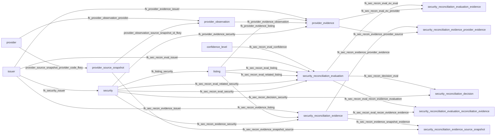

```mermaid
flowchart LR
  confidence_level["confidence_level"]
  issuer["issuer"]
  listing["listing"]
  provider["provider"]
  provider_evidence["provider_evidence"]
  provider_observation["provider_observation"]
  provider_source_snapshot["provider_source_snapshot"]
  security["security"]
  security_reconciliation_decision["security_reconciliation_decision"]
  security_reconciliation_evaluation["security_reconciliation_evaluation"]
  security_reconciliation_evaluation_evidence["security_reconciliation_evaluation_evidence"]
  security_reconciliation_evaluation_reconciliation_evidence["security_reconciliation_evaluation_reconciliation_evidence"]
  security_reconciliation_evidence["security_reconciliation_evidence"]
  security_reconciliation_evidence_provider_evidence["security_reconciliation_evidence_provider_evidence"]
  security_reconciliation_evidence_source_snapshot["security_reconciliation_evidence_source_snapshot"]

  security -->|fk_listing_security| listing
  issuer -->|fk_provider_evidence_issuer| provider_evidence
  listing -->|fk_provider_evidence_listing| provider_evidence
  provider_observation -->|fk_provider_evidence_observation| provider_evidence
  security -->|fk_provider_evidence_security| provider_evidence
  provider -->|fk_provider_observation_provider| provider_observation
  provider_source_snapshot -->|provider_observation_source_snapshot_id_fkey| provider_observation
  provider -->|provider_source_snapshot_provider_code_fkey| provider_source_snapshot
  issuer -->|fk_security_issuer| security
  security_reconciliation_evaluation -->|fk_sec_recon_decision_eval| security_reconciliation_decision
  security -->|fk_sec_recon_decision_security| security_reconciliation_decision
  confidence_level -->|fk_sec_recon_eval_confidence| security_reconciliation_evaluation
  issuer -->|fk_sec_recon_eval_issuer| security_reconciliation_evaluation
  listing -->|fk_sec_recon_eval_listing| security_reconciliation_evaluation
  listing -->|fk_sec_recon_eval_related_listing| security_reconciliation_evaluation
  security -->|fk_sec_recon_eval_related_security| security_reconciliation_evaluation
  security -->|fk_sec_recon_eval_security| security_reconciliation_evaluation
  security_reconciliation_evaluation -->|fk_sec_recon_eval_ev_eval| security_reconciliation_evaluation_evidence
  provider_evidence -->|fk_sec_recon_eval_ev_provider| security_reconciliation_evaluation_evidence
  security_reconciliation_evaluation -->|fk_sec_recon_eval_recon_evidence_evaluation| security_reconciliation_evaluation_reconciliation_evidence
  security_reconciliation_evidence -->|fk_sec_recon_eval_recon_evidence_evidence| security_reconciliation_evaluation_reconciliation_evidence
  issuer -->|fk_sec_recon_evidence_issuer| security_reconciliation_evidence
  listing -->|fk_sec_recon_evidence_listing| security_reconciliation_evidence
  security -->|fk_sec_recon_evidence_security| security_reconciliation_evidence
  security_reconciliation_evidence -->|fk_sec_recon_evidence_provider_evidence| security_reconciliation_evidence_provider_evidence
  provider_evidence -->|fk_sec_recon_evidence_provider_source| security_reconciliation_evidence_provider_evidence
  security_reconciliation_evidence -->|fk_sec_recon_evidence_snapshot_evidence| security_reconciliation_evidence_source_snapshot
  provider_source_snapshot -->|fk_sec_recon_evidence_snapshot_source| security_reconciliation_evidence_source_snapshot
```
