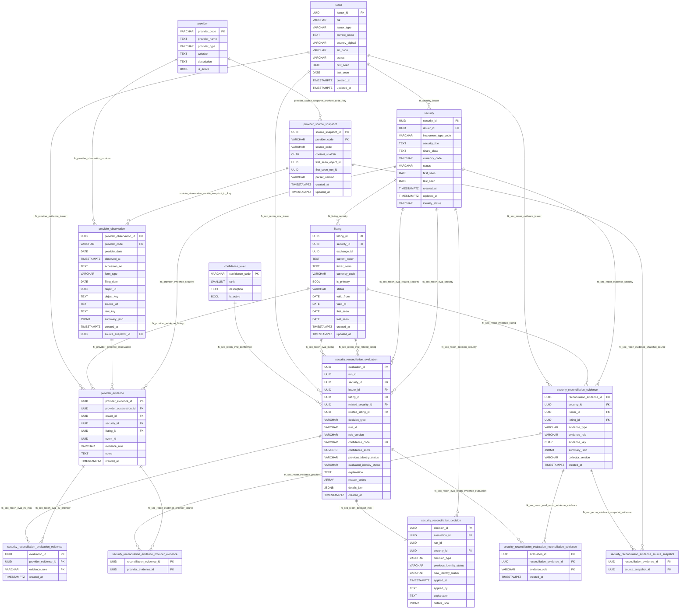

```mermaid
erDiagram
  confidence_level {
    VARCHAR confidence_code PK
    SMALLINT rank
    TEXT description
    BOOL is_active
  }

  issuer {
    UUID issuer_id PK
    VARCHAR cik
    VARCHAR issuer_type
    TEXT current_name
    VARCHAR country_alpha2
    VARCHAR sic_code
    VARCHAR status
    DATE first_seen
    DATE last_seen
    TIMESTAMPTZ created_at
    TIMESTAMPTZ updated_at
  }

  listing {
    UUID listing_id PK
    UUID security_id FK
    UUID exchange_id
    TEXT current_ticker
    TEXT ticker_norm
    VARCHAR currency_code
    BOOL is_primary
    VARCHAR status
    DATE valid_from
    DATE valid_to
    DATE first_seen
    DATE last_seen
    TIMESTAMPTZ created_at
    TIMESTAMPTZ updated_at
  }

  provider {
    VARCHAR provider_code PK
    TEXT provider_name
    VARCHAR provider_type
    TEXT website
    TEXT description
    BOOL is_active
  }

  provider_evidence {
    UUID provider_evidence_id PK
    UUID provider_observation_id FK
    UUID issuer_id FK
    UUID security_id FK
    UUID listing_id FK
    UUID event_id
    VARCHAR evidence_role
    TEXT notes
    TIMESTAMPTZ created_at
  }

  provider_observation {
    UUID provider_observation_id PK
    VARCHAR provider_code FK
    DATE provider_date
    TIMESTAMPTZ observed_at
    TEXT accession_no
    VARCHAR form_type
    DATE filing_date
    UUID object_id
    TEXT object_key
    TEXT source_url
    TEXT raw_key
    JSONB summary_json
    TIMESTAMPTZ created_at
    UUID source_snapshot_id FK
  }

  provider_source_snapshot {
    UUID source_snapshot_id PK
    VARCHAR provider_code FK
    VARCHAR source_code
    CHAR content_sha256
    UUID first_seen_object_id
    UUID first_seen_run_id
    VARCHAR parser_version
    TIMESTAMPTZ created_at
    TIMESTAMPTZ updated_at
  }

  security {
    UUID security_id PK
    UUID issuer_id FK
    VARCHAR instrument_type_code
    TEXT security_title
    TEXT share_class
    VARCHAR currency_code
    VARCHAR status
    DATE first_seen
    DATE last_seen
    TIMESTAMPTZ created_at
    TIMESTAMPTZ updated_at
    VARCHAR identity_status
  }

  security_reconciliation_decision {
    UUID decision_id PK
    UUID evaluation_id FK
    UUID run_id
    UUID security_id FK
    VARCHAR decision_type
    VARCHAR previous_identity_status
    VARCHAR new_identity_status
    TIMESTAMPTZ applied_at
    TEXT applied_by
    TEXT explanation
    JSONB details_json
  }

  security_reconciliation_evaluation {
    UUID evaluation_id PK
    UUID run_id
    UUID security_id FK
    UUID issuer_id FK
    UUID listing_id FK
    UUID related_security_id FK
    UUID related_listing_id FK
    VARCHAR decision_type
    VARCHAR rule_id
    VARCHAR rule_version
    VARCHAR confidence_code FK
    NUMERIC confidence_score
    VARCHAR previous_identity_status
    VARCHAR evaluated_identity_status
    TEXT explanation
    ARRAY reason_codes
    JSONB details_json
    TIMESTAMPTZ created_at
  }

  security_reconciliation_evaluation_evidence {
    UUID evaluation_id PK
    UUID provider_evidence_id PK
    VARCHAR evidence_role PK
    TIMESTAMPTZ created_at
  }

  security_reconciliation_evaluation_reconciliation_evidence {
    UUID evaluation_id PK
    UUID reconciliation_evidence_id PK
    VARCHAR evidence_role PK
    TIMESTAMPTZ created_at
  }

  security_reconciliation_evidence {
    UUID reconciliation_evidence_id PK
    UUID security_id FK
    UUID issuer_id FK
    UUID listing_id FK
    VARCHAR evidence_type
    VARCHAR evidence_role
    CHAR evidence_key
    JSONB summary_json
    VARCHAR collector_version
    TIMESTAMPTZ created_at
  }

  security_reconciliation_evidence_provider_evidence {
    UUID reconciliation_evidence_id PK
    UUID provider_evidence_id PK
  }

  security_reconciliation_evidence_source_snapshot {
    UUID reconciliation_evidence_id PK
    UUID source_snapshot_id PK
  }

  security ||--o{ listing : "fk_listing_security"
  issuer ||--o{ provider_evidence : "fk_provider_evidence_issuer"
  listing ||--o{ provider_evidence : "fk_provider_evidence_listing"
  provider_observation ||--o{ provider_evidence : "fk_provider_evidence_observation"
  security ||--o{ provider_evidence : "fk_provider_evidence_security"
  provider ||--o{ provider_observation : "fk_provider_observation_provider"
  provider_source_snapshot ||--o{ provider_observation : "provider_observation_source_snapshot_id_fkey"
  provider ||--o{ provider_source_snapshot : "provider_source_snapshot_provider_code_fkey"
  issuer ||--o{ security : "fk_security_issuer"
  security_reconciliation_evaluation ||--|| security_reconciliation_decision : "fk_sec_recon_decision_eval"
  security ||--o{ security_reconciliation_decision : "fk_sec_recon_decision_security"
  confidence_level ||--o{ security_reconciliation_evaluation : "fk_sec_recon_eval_confidence"
  issuer ||--o{ security_reconciliation_evaluation : "fk_sec_recon_eval_issuer"
  listing ||--o{ security_reconciliation_evaluation : "fk_sec_recon_eval_listing"
  listing ||--o{ security_reconciliation_evaluation : "fk_sec_recon_eval_related_listing"
  security ||--o{ security_reconciliation_evaluation : "fk_sec_recon_eval_related_security"
  security ||--o{ security_reconciliation_evaluation : "fk_sec_recon_eval_security"
  security_reconciliation_evaluation ||--o{ security_reconciliation_evaluation_evidence : "fk_sec_recon_eval_ev_eval"
  provider_evidence ||--o{ security_reconciliation_evaluation_evidence : "fk_sec_recon_eval_ev_provider"
  security_reconciliation_evaluation ||--o{ security_reconciliation_evaluation_reconciliation_evidence : "fk_sec_recon_eval_recon_evidence_evaluation"
  security_reconciliation_evidence ||--o{ security_reconciliation_evaluation_reconciliation_evidence : "fk_sec_recon_eval_recon_evidence_evidence"
  issuer ||--o{ security_reconciliation_evidence : "fk_sec_recon_evidence_issuer"
  listing ||--o{ security_reconciliation_evidence : "fk_sec_recon_evidence_listing"
  security ||--o{ security_reconciliation_evidence : "fk_sec_recon_evidence_security"
  security_reconciliation_evidence ||--o{ security_reconciliation_evidence_provider_evidence : "fk_sec_recon_evidence_provider_evidence"
  provider_evidence ||--o{ security_reconciliation_evidence_provider_evidence : "fk_sec_recon_evidence_provider_source"
  security_reconciliation_evidence ||--o{ security_reconciliation_evidence_source_snapshot : "fk_sec_recon_evidence_snapshot_evidence"
  provider_source_snapshot ||--o{ security_reconciliation_evidence_source_snapshot : "fk_sec_recon_evidence_snapshot_source"
```
