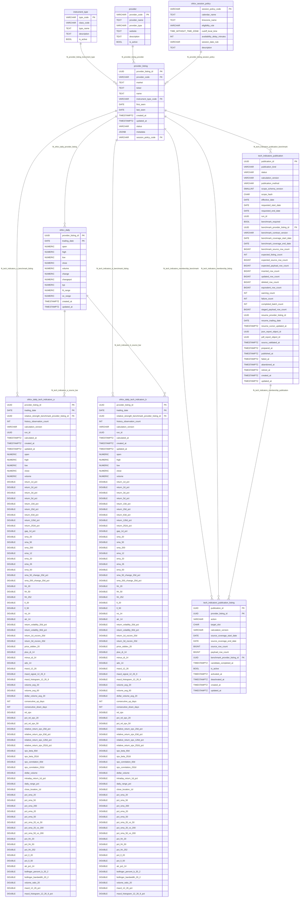

```mermaid
erDiagram
  instrument_type {
    VARCHAR type_code PK
    VARCHAR class_code
    TEXT type_name
    TEXT description
    BOOL is_active
  }

  ohlcv_daily {
    UUID provider_listing_id PK
    DATE trading_date PK
    NUMERIC open
    NUMERIC high
    NUMERIC low
    NUMERIC close
    NUMERIC volume
    NUMERIC change
    NUMERIC changepct
    NUMERIC typ
    NUMERIC hl_range
    NUMERIC oc_range
    TIMESTAMPTZ created_at
    TIMESTAMPTZ updated_at
  }

  ohlcv_daily_tech_indicators_a {
    UUID provider_listing_id PK
    DATE trading_date PK
    UUID relative_strength_benchmark_provider_listing_id FK
    INT history_observation_count
    VARCHAR calculation_version
    UUID run_id
    TIMESTAMPTZ calculated_at
    TIMESTAMPTZ created_at
    TIMESTAMPTZ updated_at
    NUMERIC open
    NUMERIC high
    NUMERIC low
    NUMERIC close
    NUMERIC volume
    DOUBLE return_1d_pct
    DOUBLE return_2d_pct
    DOUBLE return_3d_pct
    DOUBLE return_5d_pct
    DOUBLE return_10d_pct
    DOUBLE return_20d_pct
    DOUBLE return_63d_pct
    DOUBLE return_126d_pct
    DOUBLE return_252d_pct
    DOUBLE gap_1d_pct
    DOUBLE sma_20
    DOUBLE sma_50
    DOUBLE sma_200
    DOUBLE ema_12
    DOUBLE ema_20
    DOUBLE ema_26
    DOUBLE ema_50
    DOUBLE sma_50_change_20d_pct
    DOUBLE sma_200_change_20d_pct
    DOUBLE hh_20
    DOUBLE hh_50
    DOUBLE hh_252
    DOUBLE ll_20
    DOUBLE ll_50
    DOUBLE rsi_14
    DOUBLE atr_14
    DOUBLE return_volatility_20d_pct
    DOUBLE return_volatility_60d_pct
    DOUBLE return_1d_zscore_20d
    DOUBLE return_3d_zscore_20d
    DOUBLE price_stddev_20
    DOUBLE plus_di_14
    DOUBLE minus_di_14
    DOUBLE adx_14
    DOUBLE macd_12_26
    DOUBLE macd_signal_12_26_9
    DOUBLE macd_histogram_12_26_9
    DOUBLE volume_avg_20
    DOUBLE volume_avg_60
    DOUBLE dollar_volume_avg_20
    INT consecutive_up_days
    INT consecutive_down_days
    DOUBLE rel_spx
    DOUBLE pct_rel_spx_20
    DOUBLE pct_rel_spx_50
    DOUBLE relative_return_spx_20d_pct
    DOUBLE relative_return_spx_63d_pct
    DOUBLE relative_return_spx_126d_pct
    DOUBLE relative_return_spx_252d_pct
    DOUBLE spx_beta_60d
    DOUBLE spx_beta_252d
    DOUBLE spx_correlation_60d
    DOUBLE spx_correlation_252d
    DOUBLE dollar_volume
    DOUBLE intraday_return_1d_pct
    DOUBLE daily_range_pct
    DOUBLE close_location_1d
    DOUBLE pct_sma_20
    DOUBLE pct_sma_50
    DOUBLE pct_sma_200
    DOUBLE pct_ema_20
    DOUBLE pct_ema_50
    DOUBLE pct_sma_20_vs_50
    DOUBLE pct_sma_20_vs_200
    DOUBLE pct_sma_50_vs_200
    DOUBLE pct_hh_20
    DOUBLE pct_hh_50
    DOUBLE pct_hh_252
    DOUBLE pct_ll_20
    DOUBLE pct_ll_50
    DOUBLE atr_pct_14
    DOUBLE bollinger_percent_b_20_2
    DOUBLE bollinger_bandwidth_20_2
    DOUBLE volume_ratio_20
    DOUBLE macd_12_26_pct
    DOUBLE macd_histogram_12_26_9_pct
  }

  ohlcv_daily_tech_indicators_b {
    UUID provider_listing_id PK
    DATE trading_date PK
    UUID relative_strength_benchmark_provider_listing_id FK
    INT history_observation_count
    VARCHAR calculation_version
    UUID run_id
    TIMESTAMPTZ calculated_at
    TIMESTAMPTZ created_at
    TIMESTAMPTZ updated_at
    NUMERIC open
    NUMERIC high
    NUMERIC low
    NUMERIC close
    NUMERIC volume
    DOUBLE return_1d_pct
    DOUBLE return_2d_pct
    DOUBLE return_3d_pct
    DOUBLE return_5d_pct
    DOUBLE return_10d_pct
    DOUBLE return_20d_pct
    DOUBLE return_63d_pct
    DOUBLE return_126d_pct
    DOUBLE return_252d_pct
    DOUBLE gap_1d_pct
    DOUBLE sma_20
    DOUBLE sma_50
    DOUBLE sma_200
    DOUBLE ema_12
    DOUBLE ema_20
    DOUBLE ema_26
    DOUBLE ema_50
    DOUBLE sma_50_change_20d_pct
    DOUBLE sma_200_change_20d_pct
    DOUBLE hh_20
    DOUBLE hh_50
    DOUBLE hh_252
    DOUBLE ll_20
    DOUBLE ll_50
    DOUBLE rsi_14
    DOUBLE atr_14
    DOUBLE return_volatility_20d_pct
    DOUBLE return_volatility_60d_pct
    DOUBLE return_1d_zscore_20d
    DOUBLE return_3d_zscore_20d
    DOUBLE price_stddev_20
    DOUBLE plus_di_14
    DOUBLE minus_di_14
    DOUBLE adx_14
    DOUBLE macd_12_26
    DOUBLE macd_signal_12_26_9
    DOUBLE macd_histogram_12_26_9
    DOUBLE volume_avg_20
    DOUBLE volume_avg_60
    DOUBLE dollar_volume_avg_20
    INT consecutive_up_days
    INT consecutive_down_days
    DOUBLE rel_spx
    DOUBLE pct_rel_spx_20
    DOUBLE pct_rel_spx_50
    DOUBLE relative_return_spx_20d_pct
    DOUBLE relative_return_spx_63d_pct
    DOUBLE relative_return_spx_126d_pct
    DOUBLE relative_return_spx_252d_pct
    DOUBLE spx_beta_60d
    DOUBLE spx_beta_252d
    DOUBLE spx_correlation_60d
    DOUBLE spx_correlation_252d
    DOUBLE dollar_volume
    DOUBLE intraday_return_1d_pct
    DOUBLE daily_range_pct
    DOUBLE close_location_1d
    DOUBLE pct_sma_20
    DOUBLE pct_sma_50
    DOUBLE pct_sma_200
    DOUBLE pct_ema_20
    DOUBLE pct_ema_50
    DOUBLE pct_sma_20_vs_50
    DOUBLE pct_sma_20_vs_200
    DOUBLE pct_sma_50_vs_200
    DOUBLE pct_hh_20
    DOUBLE pct_hh_50
    DOUBLE pct_hh_252
    DOUBLE pct_ll_20
    DOUBLE pct_ll_50
    DOUBLE atr_pct_14
    DOUBLE bollinger_percent_b_20_2
    DOUBLE bollinger_bandwidth_20_2
    DOUBLE volume_ratio_20
    DOUBLE macd_12_26_pct
    DOUBLE macd_histogram_12_26_9_pct
  }

  ohlcv_session_policy {
    VARCHAR session_policy_code PK
    TEXT calendar_name
    TEXT timezone_name
    VARCHAR eligibility_rule
    TIME_WITHOUT_TIME_ZONE cutoff_local_time
    INT availability_delay_minutes
    VARCHAR session_date_rule
    TEXT description
  }

  provider {
    VARCHAR provider_code PK
    TEXT provider_name
    VARCHAR provider_type
    TEXT website
    TEXT description
    BOOL is_active
  }

  provider_listing {
    UUID provider_listing_id PK
    VARCHAR provider_code FK
    TEXT market
    TEXT ticker
    TEXT name
    VARCHAR instrument_type_code FK
    DATE first_seen
    DATE last_seen
    TIMESTAMPTZ created_at
    TIMESTAMPTZ updated_at
    VARCHAR status
    JSONB metadata
    VARCHAR session_policy_code FK
  }

  tech_indicators_publication {
    UUID publication_id PK
    VARCHAR publication_kind
    VARCHAR status
    VARCHAR calculation_version
    VARCHAR publication_method
    SMALLINT scope_schema_version
    CHAR scope_hash
    DATE effective_date
    DATE requested_start_date
    DATE requested_end_date
    UUID run_id
    BOOL benchmark_required
    UUID benchmark_provider_listing_id FK
    VARCHAR benchmark_contract_version
    DATE benchmark_coverage_start_date
    DATE benchmark_coverage_end_date
    BIGINT benchmark_source_row_count
    INT expected_listing_count
    BIGINT expected_source_row_count
    BIGINT expected_payload_row_count
    BIGINT inserted_row_count
    BIGINT updated_row_count
    BIGINT deleted_row_count
    BIGINT equivalent_row_count
    INT warning_count
    INT failure_count
    INT completed_batch_count
    BIGINT staged_payload_row_count
    UUID resume_provider_listing_id
    DATE resume_trading_date
    TIMESTAMPTZ resume_cursor_updated_at
    UUID json_report_object_id
    UUID pdf_report_object_id
    TIMESTAMPTZ source_validated_at
    TIMESTAMPTZ prepared_at
    TIMESTAMPTZ published_at
    TIMESTAMPTZ failed_at
    TIMESTAMPTZ abandoned_at
    TIMESTAMPTZ retired_at
    TIMESTAMPTZ created_at
    TIMESTAMPTZ updated_at
  }

  tech_indicators_publication_listing {
    UUID publication_id PK
    UUID provider_listing_id PK
    VARCHAR action
    CHAR target_slot
    VARCHAR calculation_version
    DATE source_coverage_start_date
    DATE source_coverage_end_date
    BIGINT source_row_count
    BIGINT payload_row_count
    UUID benchmark_provider_listing_id FK
    TIMESTAMPTZ candidate_completed_at
    BOOL is_active
    TIMESTAMPTZ activated_at
    TIMESTAMPTZ deactivated_at
    TIMESTAMPTZ created_at
    TIMESTAMPTZ updated_at
  }

  provider_listing ||--o{ ohlcv_daily : "fk_ohlcv_daily_provider_listing"
  provider_listing ||--o{ ohlcv_daily_tech_indicators_a : "fk_tech_indicators_a_benchmark_listing"
  ohlcv_daily ||--o{ ohlcv_daily_tech_indicators_a : "fk_tech_indicators_a_source_bar"
  provider_listing ||--o{ ohlcv_daily_tech_indicators_b : "fk_tech_indicators_b_benchmark_listing"
  ohlcv_daily ||--o{ ohlcv_daily_tech_indicators_b : "fk_tech_indicators_b_source_bar"
  instrument_type ||--o{ provider_listing : "fk_provider_listing_instrument_type"
  provider ||--o{ provider_listing : "fk_provider_listing_provider"
  ohlcv_session_policy ||--o{ provider_listing : "fk_provider_listing_session_policy"
  provider_listing ||--o{ tech_indicators_publication : "fk_tech_indicators_publication_benchmark"
  provider_listing ||--o{ tech_indicators_publication_listing : "fk_tech_indicators_membership_benchmark"
  provider_listing ||--o{ tech_indicators_publication_listing : "fk_tech_indicators_membership_listing"
  tech_indicators_publication ||--o{ tech_indicators_publication_listing : "fk_tech_indicators_membership_publication"
```
