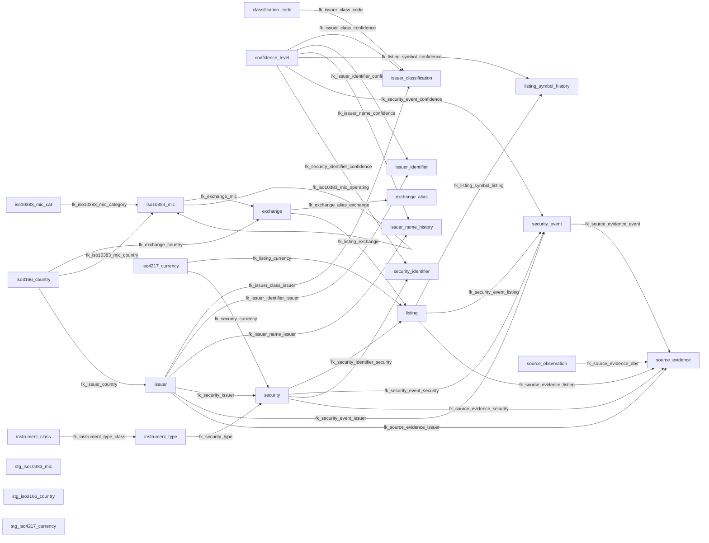

```mermaid
flowchart LR
  classification_code["classification_code"]
  confidence_level["confidence_level"]
  exchange["exchange"]
  exchange_alias["exchange_alias"]
  instrument_class["instrument_class"]
  instrument_type["instrument_type"]
  iso10383_mic["iso10383_mic"]
  iso10383_mic_cat["iso10383_mic_cat"]
  iso3166_country["iso3166_country"]
  iso4217_currency["iso4217_currency"]
  issuer["issuer"]
  issuer_classification["issuer_classification"]
  issuer_identifier["issuer_identifier"]
  issuer_name_history["issuer_name_history"]
  listing["listing"]
  listing_symbol_history["listing_symbol_history"]
  security["security"]
  security_event["security_event"]
  security_identifier["security_identifier"]
  source_evidence["source_evidence"]
  source_observation["source_observation"]
  stg_iso10383_mic["stg_iso10383_mic"]
  stg_iso3166_country["stg_iso3166_country"]
  stg_iso4217_currency["stg_iso4217_currency"]

  iso3166_country -->|fk_exchange_country| exchange
  iso10383_mic -->|fk_exchange_mic| exchange
  exchange -->|fk_exchange_alias_exchange| exchange_alias
  instrument_class -->|fk_instrument_type_class| instrument_type
  iso10383_mic_cat -->|fk_iso10383_mic_category| iso10383_mic
  iso3166_country -->|fk_iso10383_mic_country| iso10383_mic
  iso10383_mic -->|fk_iso10383_mic_operating| iso10383_mic
  iso3166_country -->|fk_issuer_country| issuer
  classification_code -->|fk_issuer_class_code| issuer_classification
  confidence_level -->|fk_issuer_class_confidence| issuer_classification
  issuer -->|fk_issuer_class_issuer| issuer_classification
  confidence_level -->|fk_issuer_identifier_confidence| issuer_identifier
  issuer -->|fk_issuer_identifier_issuer| issuer_identifier
  confidence_level -->|fk_issuer_name_confidence| issuer_name_history
  issuer -->|fk_issuer_name_issuer| issuer_name_history
  iso4217_currency -->|fk_listing_currency| listing
  exchange -->|fk_listing_exchange| listing
  security -->|fk_listing_security| listing
  confidence_level -->|fk_listing_symbol_confidence| listing_symbol_history
  listing -->|fk_listing_symbol_listing| listing_symbol_history
  iso4217_currency -->|fk_security_currency| security
  issuer -->|fk_security_issuer| security
  instrument_type -->|fk_security_type| security
  confidence_level -->|fk_security_event_confidence| security_event
  issuer -->|fk_security_event_issuer| security_event
  listing -->|fk_security_event_listing| security_event
  security -->|fk_security_event_security| security_event
  confidence_level -->|fk_security_identifier_confidence| security_identifier
  security -->|fk_security_identifier_security| security_identifier
  security_event -->|fk_source_evidence_event| source_evidence
  issuer -->|fk_source_evidence_issuer| source_evidence
  listing -->|fk_source_evidence_listing| source_evidence
  source_observation -->|fk_source_evidence_obs| source_evidence
  security -->|fk_source_evidence_security| source_evidence
```
