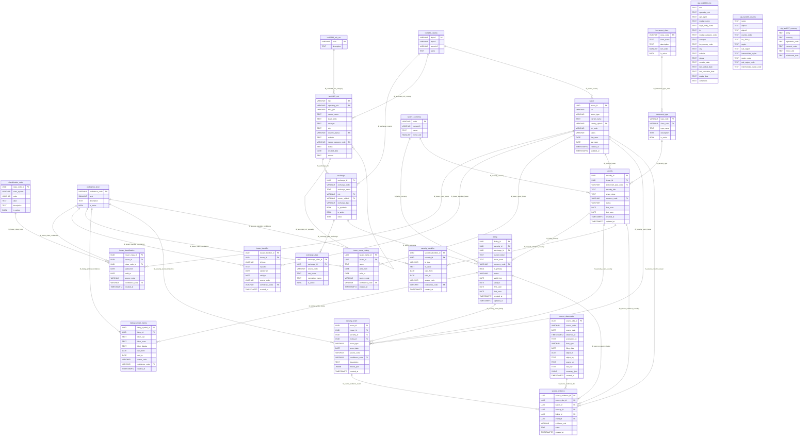

```mermaid
erDiagram
  classification_code {
    UUID class_code_id PK
    VARCHAR class_system
    VARCHAR code
    TEXT label
    TEXT description
    BOOL is_active
  }

  confidence_level {
    VARCHAR confidence_code PK
    SMALLINT rank
    TEXT description
    BOOL is_active
  }

  exchange {
    UUID exchange_id PK
    VARCHAR exchange_code
    TEXT exchange_name
    VARCHAR mic FK
    VARCHAR country_alpha2 FK
    VARCHAR exchange_type
    BOOL is_synthetic
    BOOL is_active
    TEXT notes
  }

  exchange_alias {
    UUID exchange_alias_id PK
    UUID exchange_id FK
    VARCHAR source_code
    TEXT raw_name
    TEXT normalized_name
    BOOL is_active
  }

  instrument_class {
    VARCHAR class_code PK
    TEXT class_name
    TEXT description
    SMALLINT sort_order
    BOOL is_active
  }

  instrument_type {
    VARCHAR type_code PK
    VARCHAR class_code FK
    TEXT type_name
    TEXT description
    BOOL is_active
  }

  iso10383_mic {
    VARCHAR mic PK
    VARCHAR operating_mic FK
    VARCHAR mic_type
    TEXT market_name
    TEXT legal_entity
    TEXT acronym
    TEXT city
    VARCHAR country_alpha2 FK
    TEXT website
    VARCHAR market_category_code FK
    TEXT status
    DATE created_date
    TEXT source
  }

  iso10383_mic_cat {
    VARCHAR code PK
    TEXT description
  }

  iso3166_country {
    VARCHAR alpha2 PK
    VARCHAR alpha3
    VARCHAR numeric3
    TEXT name
  }

  iso4217_currency {
    VARCHAR code PK
    VARCHAR numeric3
    TEXT name
    SMALLINT minor_unit
  }

  issuer {
    UUID issuer_id PK
    VARCHAR cik
    VARCHAR issuer_type
    TEXT current_name
    VARCHAR country_alpha2 FK
    VARCHAR sic_code
    VARCHAR status
    DATE first_seen
    DATE last_seen
    TIMESTAMPTZ created_at
    TIMESTAMPTZ updated_at
  }

  issuer_classification {
    UUID issuer_class_id PK
    UUID issuer_id FK
    UUID class_code_id FK
    DATE valid_from
    DATE valid_to
    VARCHAR source_code
    VARCHAR confidence_code FK
    TIMESTAMPTZ created_at
  }

  issuer_identifier {
    UUID issuer_identifier_id PK
    UUID issuer_id FK
    VARCHAR id_type
    TEXT id_value
    DATE valid_from
    DATE valid_to
    VARCHAR source_code
    VARCHAR confidence_code FK
    TIMESTAMPTZ created_at
  }

  issuer_name_history {
    UUID issuer_name_id PK
    UUID issuer_id FK
    TEXT name
    DATE valid_from
    DATE valid_to
    VARCHAR source_code
    VARCHAR confidence_code FK
    TIMESTAMPTZ created_at
  }

  listing {
    UUID listing_id PK
    UUID security_id FK
    UUID exchange_id FK
    TEXT current_ticker
    TEXT ticker_norm
    VARCHAR currency_code FK
    BOOL is_primary
    VARCHAR status
    DATE valid_from
    DATE valid_to
    DATE first_seen
    DATE last_seen
    TIMESTAMPTZ created_at
    TIMESTAMPTZ updated_at
  }

  listing_symbol_history {
    UUID listing_symbol_id PK
    UUID listing_id FK
    TEXT ticker_raw
    TEXT ticker_norm
    TEXT ticker_display
    DATE valid_from
    DATE valid_to
    VARCHAR source_code
    VARCHAR confidence_code FK
    TIMESTAMPTZ created_at
  }

  security {
    UUID security_id PK
    UUID issuer_id FK
    VARCHAR instrument_type_code FK
    TEXT security_title
    TEXT share_class
    VARCHAR currency_code FK
    VARCHAR status
    DATE first_seen
    DATE last_seen
    TIMESTAMPTZ created_at
    TIMESTAMPTZ updated_at
  }

  security_event {
    UUID event_id PK
    UUID issuer_id FK
    UUID security_id FK
    UUID listing_id FK
    VARCHAR event_type
    DATE event_date
    VARCHAR source_code
    VARCHAR confidence_code FK
    TEXT description
    JSONB details_json
    TIMESTAMPTZ created_at
  }

  security_identifier {
    UUID security_identifier_id PK
    UUID security_id FK
    VARCHAR id_type
    TEXT id_value
    DATE valid_from
    DATE valid_to
    VARCHAR source_code
    VARCHAR confidence_code FK
    TIMESTAMPTZ created_at
  }

  source_evidence {
    UUID source_evidence_id PK
    UUID source_obs_id FK
    UUID issuer_id FK
    UUID security_id FK
    UUID listing_id FK
    UUID event_id FK
    VARCHAR evidence_role
    TEXT notes
    TIMESTAMPTZ created_at
  }

  source_observation {
    UUID source_obs_id PK
    VARCHAR source_code
    DATE source_date
    TIMESTAMPTZ observed_at
    TEXT accession_no
    VARCHAR form_type
    DATE filing_date
    UUID object_id
    TEXT object_key
    TEXT source_url
    TEXT raw_key
    JSONB summary_json
    TIMESTAMPTZ created_at
  }

  stg_iso10383_mic {
    TEXT mic
    TEXT operating_mic
    TEXT oprt_sgmt
    TEXT market_name
    TEXT legal_entity_name
    TEXT lei
    TEXT market_category_code
    TEXT acronym
    TEXT iso_country_code
    TEXT city
    TEXT website
    TEXT status
    TEXT creation_date
    TEXT last_update_date
    TEXT last_validation_date
    TEXT expiry_date
    TEXT comments
  }

  stg_iso3166_country {
    TEXT name
    TEXT alpha2
    TEXT alpha3
    TEXT country_code
    TEXT iso_3166_2
    TEXT region
    TEXT sub_region
    TEXT intermediate_region
    TEXT region_code
    TEXT sub_region_code
    TEXT intermediate_region_code
  }

  stg_iso4217_currency {
    TEXT entity
    TEXT currency
    TEXT alphabetic_code
    TEXT numeric_code
    TEXT minor_unit
    TEXT withdrawal_date
  }

  iso3166_country ||--o{ exchange : "fk_exchange_country"
  iso10383_mic ||--o{ exchange : "fk_exchange_mic"
  exchange ||--o{ exchange_alias : "fk_exchange_alias_exchange"
  instrument_class ||--o{ instrument_type : "fk_instrument_type_class"
  iso10383_mic_cat ||--o{ iso10383_mic : "fk_iso10383_mic_category"
  iso3166_country ||--o{ iso10383_mic : "fk_iso10383_mic_country"
  iso10383_mic ||--o{ iso10383_mic : "fk_iso10383_mic_operating"
  iso3166_country ||--o{ issuer : "fk_issuer_country"
  classification_code ||--o{ issuer_classification : "fk_issuer_class_code"
  confidence_level ||--o{ issuer_classification : "fk_issuer_class_confidence"
  issuer ||--o{ issuer_classification : "fk_issuer_class_issuer"
  confidence_level ||--o{ issuer_identifier : "fk_issuer_identifier_confidence"
  issuer ||--o{ issuer_identifier : "fk_issuer_identifier_issuer"
  confidence_level ||--o{ issuer_name_history : "fk_issuer_name_confidence"
  issuer ||--o{ issuer_name_history : "fk_issuer_name_issuer"
  iso4217_currency ||--o{ listing : "fk_listing_currency"
  exchange ||--o{ listing : "fk_listing_exchange"
  security ||--o{ listing : "fk_listing_security"
  confidence_level ||--o{ listing_symbol_history : "fk_listing_symbol_confidence"
  listing ||--o{ listing_symbol_history : "fk_listing_symbol_listing"
  iso4217_currency ||--o{ security : "fk_security_currency"
  issuer ||--o{ security : "fk_security_issuer"
  instrument_type ||--o{ security : "fk_security_type"
  confidence_level ||--o{ security_event : "fk_security_event_confidence"
  issuer ||--o{ security_event : "fk_security_event_issuer"
  listing ||--o{ security_event : "fk_security_event_listing"
  security ||--o{ security_event : "fk_security_event_security"
  confidence_level ||--o{ security_identifier : "fk_security_identifier_confidence"
  security ||--o{ security_identifier : "fk_security_identifier_security"
  security_event ||--o{ source_evidence : "fk_source_evidence_event"
  issuer ||--o{ source_evidence : "fk_source_evidence_issuer"
  listing ||--o{ source_evidence : "fk_source_evidence_listing"
  source_observation ||--o{ source_evidence : "fk_source_evidence_obs"
  security ||--o{ source_evidence : "fk_source_evidence_security"
```
